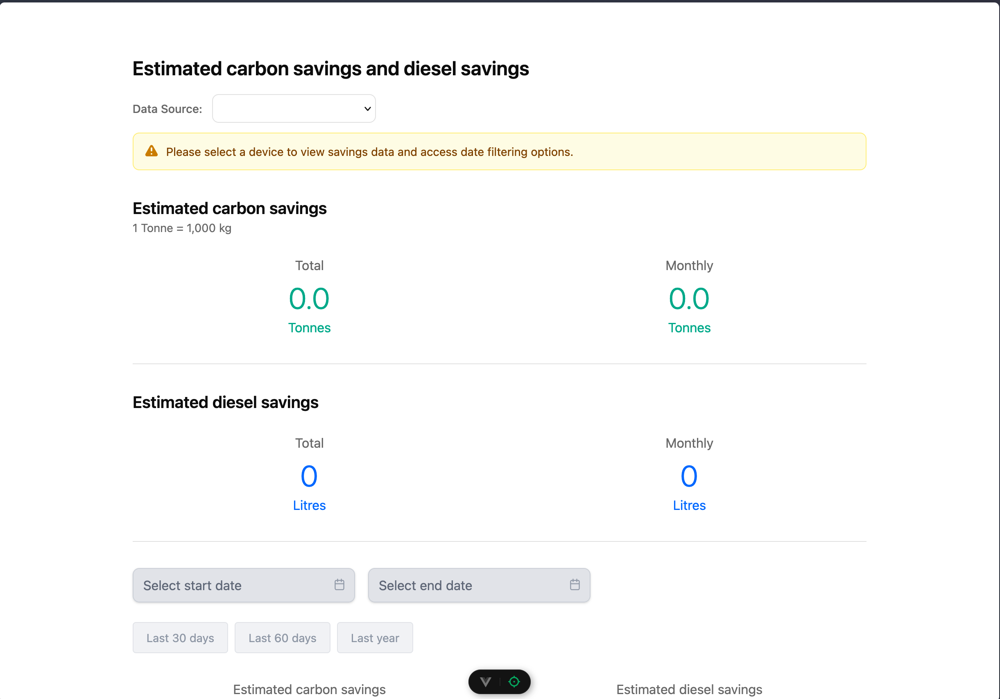
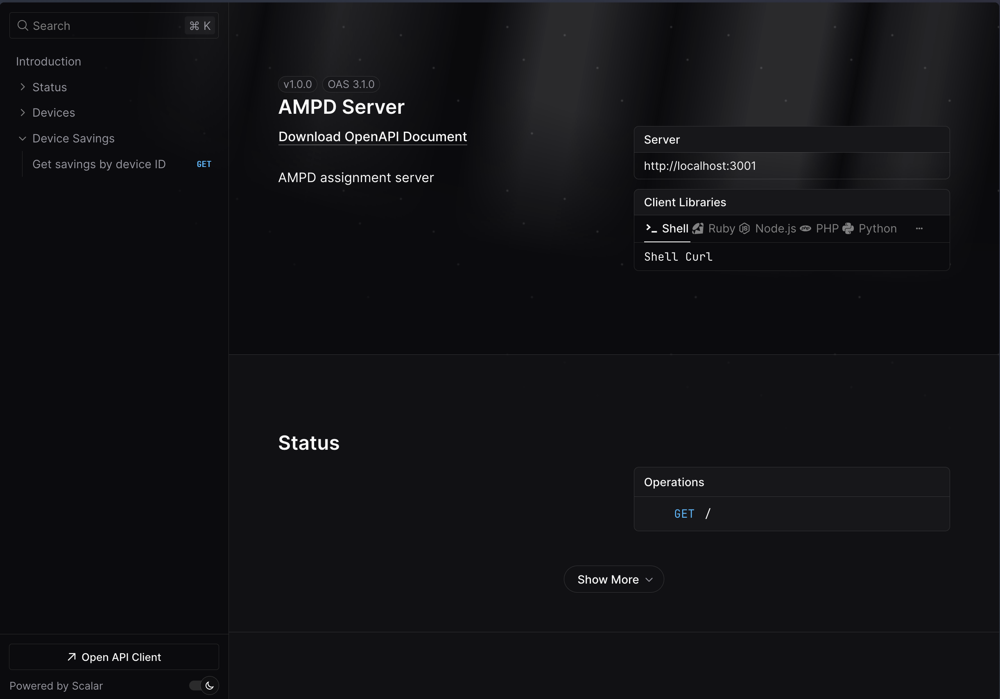

# AMPD

1. **Setup Node.js**
   ```bash
   nvm use
   ```

2. **Install dependencies**
   ```bash
   pnpm install
   ```

3. **Database setup**
   ```bash
   # Migrate database
   pnpm db:migrate
   
   # Seed with sample data
   pnpm db:seed
   
   # Reset database (if needed)
   pnpm db:reset
   ```

4. **Start the applications**
   ```bash
   # Start both frontend and backend
   pnpm dev
   ```

## Access Points

- **Frontend**: http://localhost:5173 (Vue.js client)
- **Backend API**: http://localhost:3001 (Hono server)  
- **API Documentation JSON**: http://localhost:3001/openapi/spec (OpenAPI docs json)
- **API Documentation UI**: http://localhost:3001/openapi/ui (OpenAPI docs ui)

## Screenshots

### Client Dashboard


### API Documentation

